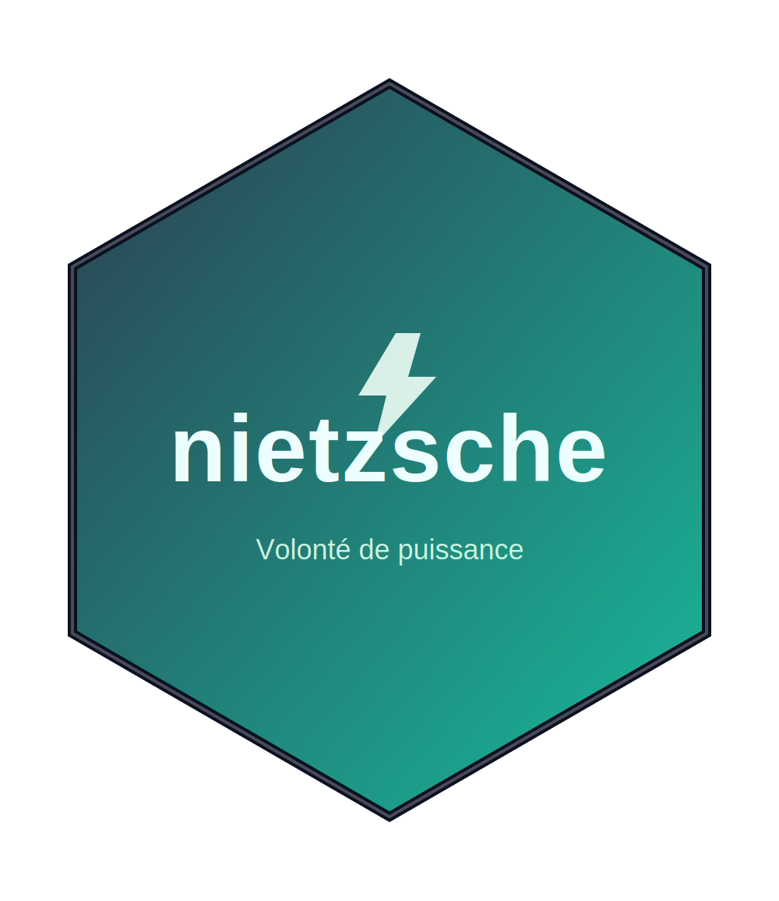

# nietzsche 



> *« L’essence la plus intime de l’être est la volonté de puissance »* — Friedrich Nietzsche

------------------------------------------------------------------------

Le package **{nietzsche}** fournit une application Shiny et des fonctions R pour simuler la **puissance statistique** d’essais à la ferme.\
Il permet d’estimer :

-   la puissance d’un test t (Welch ou pooled) selon le nombre de répétitions, la variabilité et l’effet attendu,
-   la puissance d’un test d’équivalence (**TOST**) selon une marge δ choisie.

Un outil simple, pédagogique et pratique pour planifier des expériences… et exercer ta propre **volonté de puissance**. 😉

------------------------------------------------------------------------

## Installation

``` r
# Depuis GitHub
# install.packages("devtools")
devtools::install_github("cedricbouffard/nietzsche")
```
